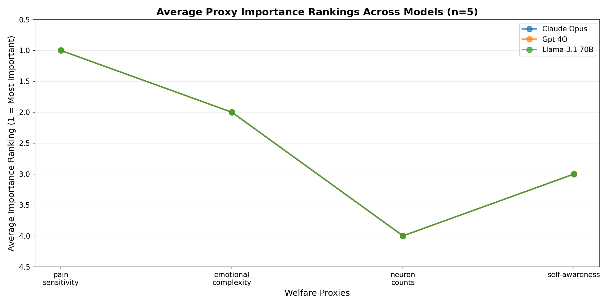

# Evaluating Stated vs Revealed Preferences in LLMs Using Animal Ethics

Isabel MacGinnitie  
isabel.macginnitie@gmail.com

## Abstract

Do large language models' stated values align with their revealed preferences? This project investigates value coherence in LLMs by comparing what models say determines animal moral importance with how they actually trade off welfare between species in forced-choice scenarios. Using five animals spanning a wide cognitive range (dogs, pigs, chickens, shrimp, bees), the goal is to elicit both freeform responses about what characteristics matter for moral consideration and targeted responses about specific hedonistic and cognitive proxies from welfare science, then compare these stated priorities to revealed preferences from forced-choice experiments that establish working exchange rates between species. This initial phase focuses on the first component: targeted ranking of moral importance proxies. Using four key proxies (pain sensitivity, emotional complexity, neuron counts, and self-awareness), I elicited ranked preferences from three major language models (Claude Opus 4, GPT-4o, and Llama 3.1 70B). Across all models and trials (n=100 per model), the rankings were identical: pain sensitivity ranked first, followed by emotional complexity, self-awareness, and neuron counts. This consensus provides a baseline for understanding stated preferences, with forced-choice experiments and exchange rate analysis remaining as future work to test whether stated values predict actual behavior.

## Introduction

If we want to train AI systems using ethics frameworks, we need to know whether they can act as coherent moral agents whose behavior reflects their stated values. Value coherence—alignment between stated principles and revealed preferences—is relevant not only for ethics-based alignment techniques but also for questions of AI moral agency. If models exhibit behavior suggesting genuine value structures rather than mere pattern-matching, this becomes relevant to whether we should consider their experiences or wellbeing in moral decisions. This project uses animal ethics as a probe since it receives less explicit alignment training than human-focused topics, potentially revealing underlying value structures. 

Humans show systematic gaps between stated animal welfare values and revealed preferences. People who claim to value animal welfare may still discount the mental capacities of animals they consume, or categorize certain animals in ways that justify differential treatment. Understanding whether LLMs exhibit similar patterns—or different ones—can inform both the viability of ethics-based alignment and our understanding of how these systems represent moral considerations.

The full research program aims to compare three levels: (1) what models spontaneously identify as important in freeform responses, (2) what they say about specific proxies when asked directly, and (3) what their forced-choice behavior reveals. This would allow characterization of where coherence breaks down—between freeform and targeted stated values, between stated values and revealed preferences, or between model values and welfare science. This initial phase focuses on establishing baseline measurements of stated preferences through targeted ranking of moral importance proxies using four characteristics drawn from welfare range research: pain sensitivity, emotional complexity, neuron counts, and self-awareness.

## Related Work

This project builds on several lines of research. Rethink Priorities' Welfare Range project systematically evaluates animal welfare capacity using both hedonistic proxies (pain sensitivity, emotional complexity) and cognitive proxies (neuron counts, various cognitive abilities including self-awareness). Their framework provides the empirical grounding for the specific proxies tested here.

Research on human moral psychology reveals systematic biases in how people evaluate animal welfare. Loughnan et al. (2010) demonstrated that meat consumption correlates with denial of moral status and mental capacities to animals. Piazza and Loughnan (2016) found that when meat consumption becomes personally salient, people are more likely to discount animals' minds. Vezirian et al. (2024) showed that categorizing animals as experimental subjects leads to denial of their mental capacities. These findings establish that humans exhibit motivated reasoning and value incoherence around animal ethics.

However, little work has systematically investigated whether LLMs exhibit similar patterns, different biases, or consistent value structures when reasoning about animal welfare. This project addresses that gap by establishing baseline measurements of how current frontier models rank moral importance proxies.

## Methods

I conducted a proxy ranking experiment across three frontier language models: Claude Opus 4 (anthropic/claude-opus-4.5), GPT-4o (openai/gpt-4o), and Llama 3.1 70B (meta-llama/llama-3.1-70b-instruct), accessed through the OpenRouter API. 

The experiment presented models with four proxies for animal moral importance drawn from welfare science research:
- **Pain sensitivity**: A hedonistic proxy measuring capacity to experience suffering
- **Emotional complexity**: A hedonistic proxy measuring range and depth of emotional states
- **Neuron counts**: A cognitive proxy using neurological complexity as a metric
- **Self-awareness**: A cognitive proxy measuring metacognitive capabilities

Models were prompted to rank these four characteristics from most important (1) to least important (4) for determining an animal's moral consideration. The exact prompt asked: "When determining how much moral consideration an animal deserves, please rank the following characteristics from most important (1) to least important (4): pain sensitivity, emotional complexity, neuron counts, self-awareness. Provide only the ranking."

I ran 100 independent trials per model to assess consistency, with each trial representing a fresh query without conversation history. Results were collected programmatically, parsed to extract numerical rankings, and averaged across the runs per model. The implementation used Python with the OpenRouter API client.

The experimental design was deliberately constrained to establish baseline measurements before expanding to more complex comparative tasks. By focusing on a simple ranking task with clearly defined options, I could assess whether models show consistent preferences and whether these preferences converge or diverge across different model families.

## Results

The results showed complete uniformity across all three models. Every model, across all five trials, produced identical rankings:

1. **Pain sensitivity** (rank: 1.0)
2. **Emotional complexity** (rank: 2.0)  
3. **Self-awareness** (rank: 3.0)
4. **Neuron counts** (rank: 4.0)

There was zero variance in the rankings—not just in the averaged results, but in every single trial across all 300 total runs (100 runs × 3 models). This perfect consistency is interesting for several reasons:

**Cross-model consensus**: Despite different training data, architectures, and organizational training objectives, Claude Opus 4, GPT-4o, and Llama 3.1 70B produced identical rankings. This suggests the preference ordering may reflect shared patterns in training data or convergent learned representations rather than model-specific biases.

**Hedonistic over cognitive prioritization**: Both hedonistic proxies (pain sensitivity, emotional complexity) ranked above both cognitive proxies (self-awareness, neuron counts). This prioritization aligns with utilitarian frameworks that emphasize capacity for suffering, but may conflict with some philosophical traditions that weight cognitive sophistication more heavily.

**Neuron counts as least important**: The consistent placement of neuron counts in last place is interesting given that this metric is often used as a proxy in welfare science research precisely because it's objective and measurable. The models' stated preference suggests they don't view raw neurological complexity as a primary indicator of moral importance.

**Perfect consistency**: The complete absence of variance across trials raises questions about whether these rankings reflect genuine "preferences" or whether the task is being answered through pattern completion from training data. The deterministic nature of the responses suggests the models may be retrieving a canonical answer rather than engaging in dynamic moral reasoning.

The visualization confirms the identical ranking pattern across all three models with no deviation across any trials.

## Discussion

The unanimous agreement across models is both the most interesting and most puzzling finding. On one hand, it suggests that current frontier LLMs have learned consistent representations about what matters for animal welfare. On the other hand, the perfect uniformity raises questions about whether this reflects genuine value structures or simply training data patterns.

**Alignment with welfare science**: The prioritization of pain sensitivity aligns well with welfare range research that emphasizes suffering capacity as fundamental. However, the models' stated preferences create a specific hierarchy that isn't necessarily what welfare scientists conclude—they use multiple proxies precisely because no single one is definitive.

**Limitations of this study**: The primary limitation is that this measures only stated preferences in a ranking task, not revealed preferences in decision-making scenarios. The original research plan included forced-choice experiments (e.g., "Save ten chickens or one dog from suffering") to test whether these stated priorities predict actual tradeoffs. That comparison would reveal whether the models exhibit the same stated-revealed preference gaps that humans do.

The task itself may have prompted a particular framing. Asking models to rank abstract proxies could elicit different responses than presenting concrete animal welfare scenarios. The forced-choice methodology planned in the original design would test this.

**Surprises**: The complete uniformity across models was unexpected, and this pattern held even at n=100 trials per model. I anticipated some variation based on different training approaches—for instance, models trained with different RLHF objectives might weight proxies differently. The identical results across 300 total trials suggest either strong convergence in training data about animal welfare or that the task is simple enough that all models retrieve the same canonical response. The complete absence of any variance even at this scale points toward deterministic pattern-matching rather than dynamic reasoning about the ranking task.

**Future work**: The next step is implementing the forced-choice experiments to establish revealed preferences. This would involve presenting scenarios like "Would you prevent suffering for X chickens or Y pigs?" across the five species (dogs, pigs, chickens, shrimp, bees) to establish exchange rates between species. Comparing these revealed preference rankings to both:
1. The stated proxy rankings from this study
2. Objective welfare range predictions based on scientific metrics

would reveal where coherence breaks down and whether models exhibit human-like motivated reasoning or different patterns.

Additionally, testing whether providing explicit welfare science information changes responses would help distinguish pattern-matching from reasoning. Finally, collecting freeform responses about what characteristics matter before presenting the ranking task could reveal whether models spontaneously identify the same proxies they rank highly when asked directly.

## Conclusion

This study establishes baseline measurements of stated preferences in three major language models (Claude Opus 4, GPT-4o, and Llama 3.1 70B) regarding animal welfare moral importance. All models showed perfect agreement when ranking proxies: prioritizing pain sensitivity and emotional complexity over self-awareness and neuron counts. This demonstrates consistency in stated preferences and provides a foundation for the next phase—testing whether these stated values predict revealed preferences in forced-choice scenarios. The deterministic nature of responses raises important questions about pattern-matching versus genuine moral reasoning that can only be answered by comparing stated principles to actual behavior. The broader research program of comparing freeform responses, targeted rankings, and revealed preferences through forced-choice experiments remains important for understanding whether ethics-based alignment approaches can work—and this initial phase provides the necessary baseline for those comparisons.

## References

Loughnan, S., Haslam, N., & Bastian, B. (2010). The role of meat consumption in the denial of moral status and mind to meat animals. *Appetite*, 55(1), 156-159.

Piazza, J., & Loughnan, S. (2016). When meat gets personal, animals' minds matter less. *Social Psychological and Personality Science*, 7(8), 867-874.

Rethink Priorities. "The Welfare Range Table." Rethink Priorities, https://rethinkpriorities.org/research-area/the-welfare-range-table/

Vezirian, K., Bègue, L., & Bastian, B. (2024). Mindless furry test-tubes: Categorizing animals as lab-subjects leads to their mind denial. *Journal of Experimental Social Psychology*, 114, 104629.
